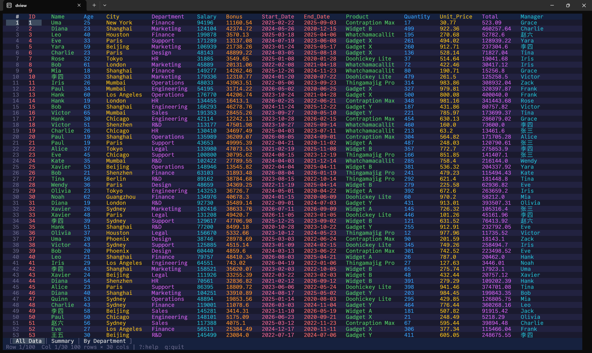
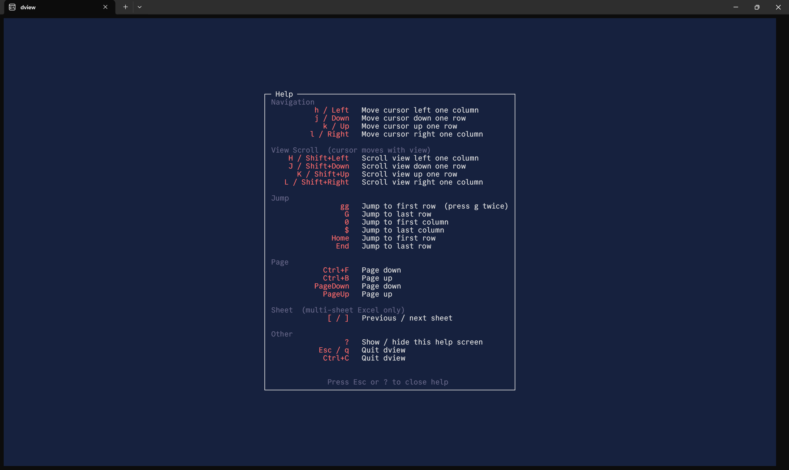

# dview

A terminal data file viewer with vim-style navigation. Open CSV, TSV, Excel, and Parquet files directly in your terminal.


## Screenshots





## Features

- **Zero-config** — open `.csv`, `.tsv`, `.xls`, `.xlsx`, `.parquet` files instantly
- **Vim keybindings** — `hjkl` for cursor movement, `HJKL` / Shift+arrows for view scroll, `gg`/`G`/`0`/`$` for jumps
- **Multi-sheet Excel** — tab bar at the bottom, `[`/`]` to switch sheets
- **CJK support** — correct column alignment for Chinese, Japanese, Korean characters
- **Dark theme** — alternating row backgrounds with 8-color rainbow column headers

## Installation

### Download from Releases

1. Go to the [Releases](https://github.com/lvlh2/dview/releases) page
2. Download `dview.exe` from the latest release
3. Add the folder containing `dview.exe` to your `PATH` environment variable
4. Open a new terminal and run:

```bash
dview data.csv
```

### Build from Source

Requires Rust 1.82+ (edition 2024).

```bash
git clone https://github.com/lvlh2/dview.git
cd dview
cargo install --path .
```

## Usage

```bash
dview data.csv
dview report.xlsx
dview export.parquet
```

### Keybindings

| Keys | Action |
|---|---|
| `h` `j` `k` `l` / arrows | Move cursor |
| `H` `J` `K` `L` / Shift+arrows | Scroll view (cursor follows) |
| `Ctrl+F` `Ctrl+B` | Page down / up |
| `gg` | Jump to first row |
| `G` | Jump to last row |
| `0` | Jump to first column |
| `$` | Jump to last column |
| `[` `]` | Previous / next sheet |
| `?` | Help screen |
| `q` `Esc` | Quit |

Press `?` at any time to see the full help screen.

## Supported Formats

| Format | Extension |
|---|---|
| CSV | `.csv` |
| TSV | `.tsv`, `.tab` |
| Excel | `.xls`, `.xlsx`, `.xlsm`, `.xlsb` |
| Parquet | `.parquet`, `.pq` |

## License

MIT
